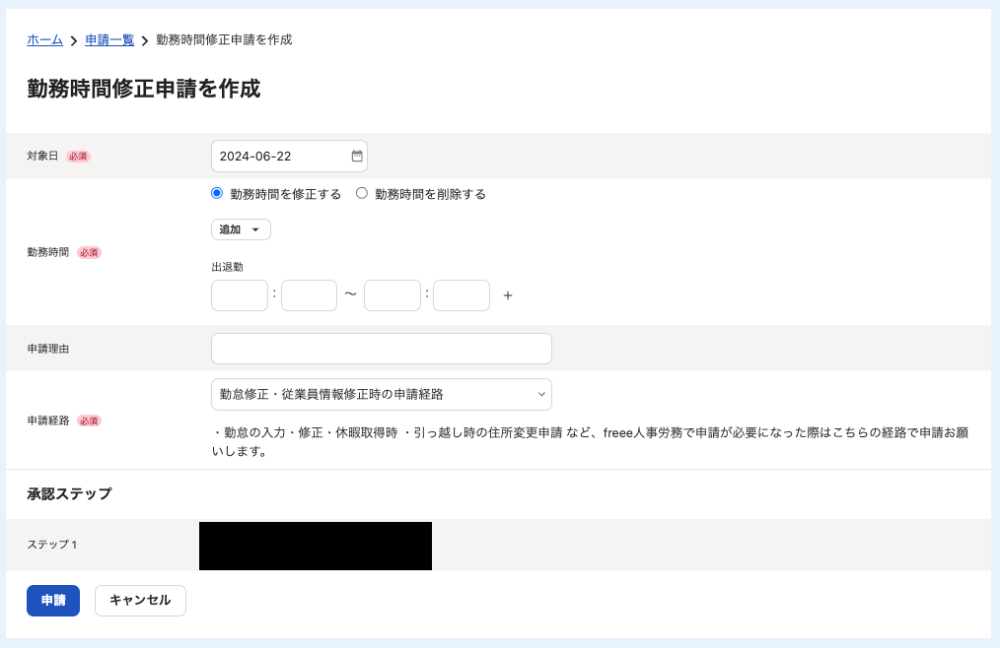
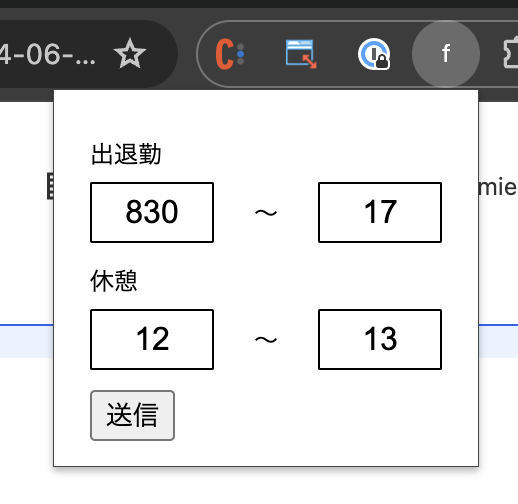
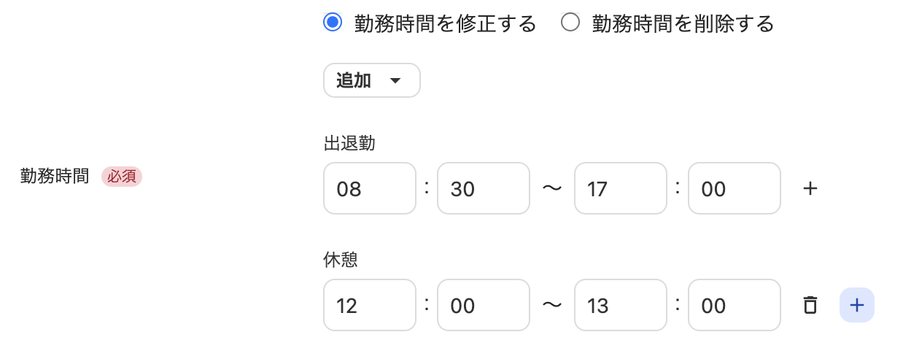

# fr〇〇〇で楽に勤怠入力できるようにするやつ

⇩のページで動作する

## インストール方法

拡張機能管理画面から登録を行う。
詳しい手順は[公式サイト](https://support.google.com/chrome/a/answer/2714278?hl=ja#:~:text=chrome%3A%2F%2Fextensions%2F%20%E3%81%AB%E3%82%A2%E3%82%AF%E3%82%BB%E3%82%B9,%E8%AA%AD%E3%81%BF%E8%BE%BC%E3%82%80%5D%20%E3%82%92%E3%82%AF%E3%83%AA%E3%83%83%E3%82%AF%E3%81%97%E3%81%BE%E3%81%99%E3%80%82)

## 使い方

1. 上記の画面にて拡張機能のアイコンを押す
2. 各入力フォームに時間をyymmの形式で入力する。
    
    0については省略できる。
    例）
     - 900 → 9:00
     - 9 → 9:00
     - 830 → 8:00
3. 「送信」を押すと反映される
    